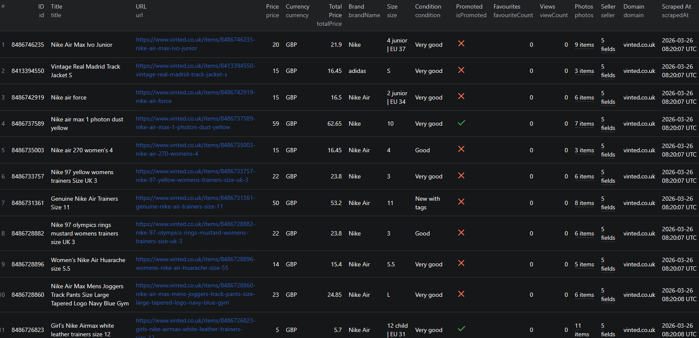

# How to Scrape Vinted Listings in Node.js

This example shows how to scrape Vinted listings in Node.js using the [Vinted Listings Scraper](https://apify.com/piotrv1001/vinted-listings-scraper) actor on Apify. No browser automation or reverse-engineering required — just call the actor via the Apify API client and get structured data back.



## What this example does

- Calls the Vinted Listings Scraper actor with a search query and item limit
- Passes proxy configuration to reliably access Vinted
- Waits for the actor run to complete
- Fetches the results from the Apify dataset
- Prints each listing to the console

## Prerequisites

- [Node.js](https://nodejs.org/) v18 or higher
- An [Apify account](https://console.apify.com/)
- An Apify API token (found in **Settings → Integrations**)

## Installation

```bash
npm install
```

## Environment setup

Copy `.env.example` to `.env` and add your Apify API token:

```bash
cp .env.example .env
```

Then edit `.env`:

```env
APIFY_TOKEN=your_apify_token_here
```

## Usage

```bash
npm start
```

## Code example

```js
import { ApifyClient } from 'apify-client';
import 'dotenv/config';

// Initialize the ApifyClient with your Apify API token
// Set APIFY_TOKEN in your .env file (copy .env.example to get started)
const client = new ApifyClient({
    token: process.env.APIFY_TOKEN,
});

// Prepare Actor input
const input = {
    "searchQueries": [
        "nike air max"
    ],
    "maxItems": 100,
    "proxyConfiguration": {
        "useApifyProxy": true,
        "apifyProxyGroups": [
            "RESIDENTIAL"
        ]
    }
};

// Run the Actor and wait for it to finish
const run = await client.actor("piotrv1001/vinted-listings-scraper").call(input);

// Fetch and print Actor results from the run's dataset (if any)
console.log('Results from dataset');
console.log(`💾 Check your data here: https://console.apify.com/storage/datasets/${run.defaultDatasetId}`);
const { items } = await client.dataset(run.defaultDatasetId).listItems();
items.forEach((item) => {
    console.dir(item);
});

// 📚 Want to learn more 📖? Go to → https://docs.apify.com/api/client/js/docs
```

## Example output

See [`sample-output.json`](./sample-output.json) for a full example. Each listing includes:

| Field | Description |
|---|---|
| `id` | Vinted item ID |
| `title` | Listing title |
| `url` | Direct link to the listing |
| `price` | Listed price |
| `currency` | Currency code (e.g. `GBP`, `EUR`) |
| `serviceFee` | Buyer protection fee |
| `totalPrice` | Price including service fee |
| `brandName` | Item brand |
| `size` | Size label |
| `condition` | Item condition (e.g. `Very good`, `Good`) |
| `isPromoted` | Whether the listing is promoted |
| `favouriteCount` | Number of times favourited |
| `viewCount` | Number of views |
| `photos` | Array of photo URLs (standard + full size) |
| `seller` | Seller ID, username, and profile URL |
| `sellerDetails` | Reputation, feedback counts, location, bio |
| `scrapedAt` | ISO timestamp of when the item was scraped |
| `domain` | Vinted domain the item was found on |

## Use cases

- **Price tracking** — monitor secondhand prices for specific brands or models over time
- **Market research** — analyse supply and demand trends for fashion categories on Vinted
- **Reseller tools** — find underpriced listings to flag for resale opportunities
- **Seller analysis** — evaluate seller reputation and inventory before purchasing
- **Academic research** — study secondhand fashion markets and circular economy behaviour

## Try the actor on Apify

**[Open the Vinted Listings Scraper on Apify](https://apify.com/piotrv1001/vinted-listings-scraper)**

## Related resources

- [How to Scrape Vinted Listings — Full Guide](https://www.falconscrape.com/blog/how-to-scrape-vinted-listings)
- [Apify JavaScript client docs](https://docs.apify.com/api/client/js/docs)

## License

MIT
